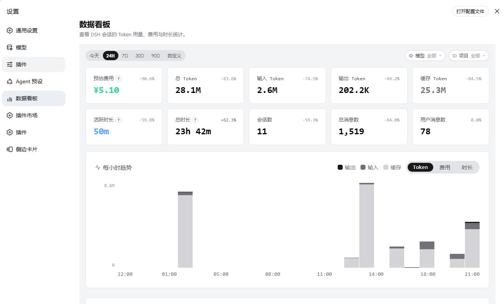
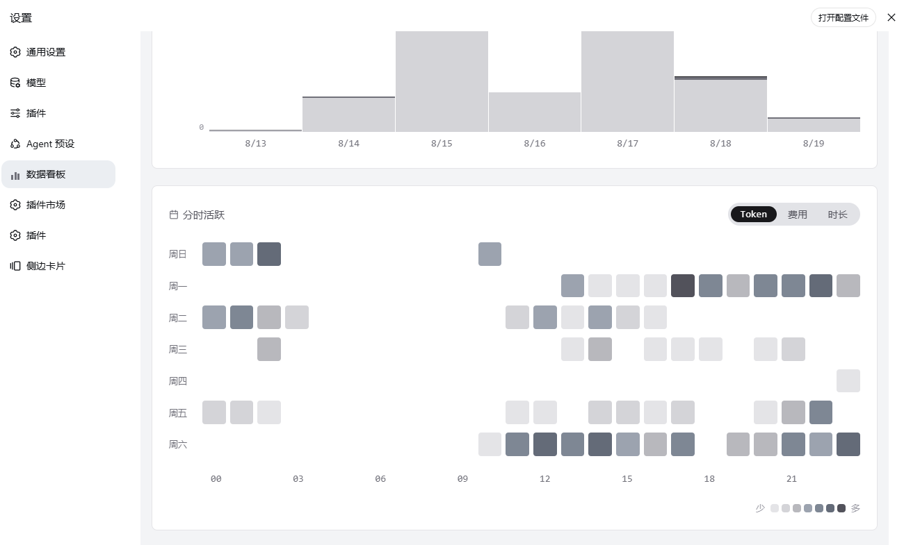
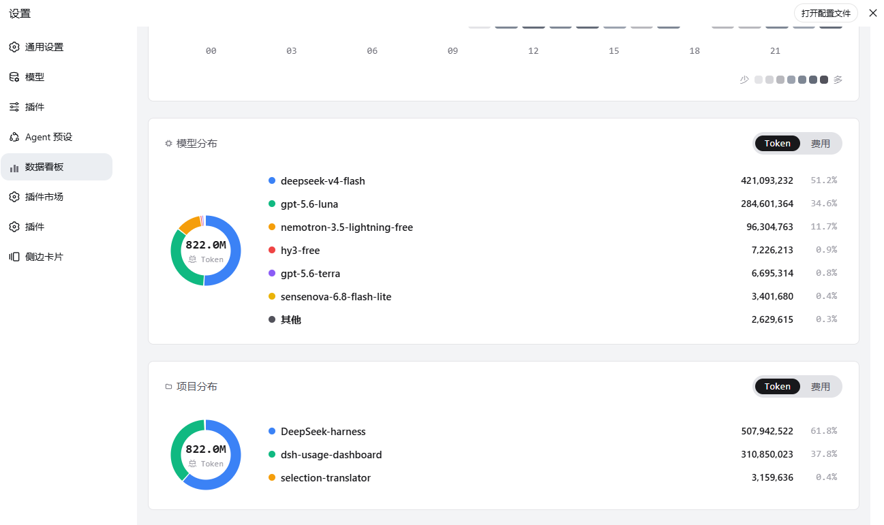
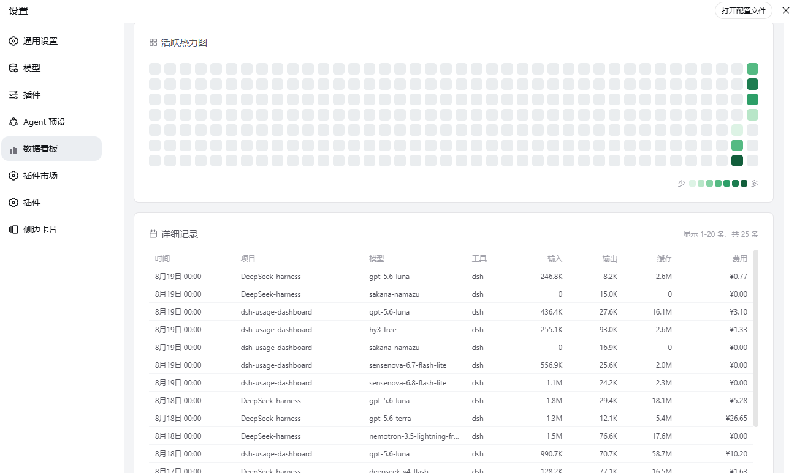

# dsh-usage-dashboard

> A local usage dashboard for the DSH (DeepSeek Harness) Web GUI — Token, cost, duration and session details, all aggregated on your machine. No session content is ever uploaded.

🌐 Language: **[中文](README.md)** · English

[](https://www.npmjs.com/package/@skkjkk/dsh-usage-dashboard) [](LICENSE)

`dsh-usage-dashboard` is a DSH **bundle plugin**. It reads local DSH session data and adds a **Settings → 数据看板** view for Token, cost, duration, session and detail statistics. All aggregation stays on the local machine; **session content is never sent to any external service**.

## Features (with screenshots)

The dashboard spans multiple layers from overview to detail. The four screenshots below show the core screens.

### 1. KPI overview and hourly trend



The top row is a set of **KPI cards**: estimated cost, total / input / output / cached Tokens, active duration, total duration, session count, total message count and user message count; each card shows a percentage change versus the previous period (a zero baseline is hidden rather than showing a fabricated `+100%`).

Below is the **hourly trend chart**: output / input / cache Tokens per hour (switchable to cost or duration), stacked in three segments; click a legend or bar to highlight a single series. The time range can be switched among `today / 24H / 7D / 30D / 90D / custom` and filtered by model or project.

### 2. Daily trend and hourly activity heatmap



On the left is the **daily trend** (day-granularity bar chart); on the right is the **hourly activity heatmap**: a `7 rows (weekday) × 24 columns (hour)` grid where color intensity encodes magnitude, switchable among `Token / cost / active duration` metrics; hovering any cell shows the exact value, with a `少 → 多` (low → high) legend.

### 3. Model and project distributions



Two **donut charts** break usage down by Token (or cost) share:

- **Model distribution**: each model's Token / cost share and absolute value; total Tokens are conserved.
- **Project distribution**: usage grouped by project, using the canonical `cwd` with DSH workspace membership as fallback.

### 4. Activity heatmap and detailed records



At the top is the **activity heatmap**: the latest 40 weeks in a `7 rows × 40 columns` calendar grid, with fixed square rounded cells and viewport-clamped edge tooltips that are never clipped by the card.

Below is the **detailed records table**: rows grouped by `time bucket × model × project`, paginated (20 rows per page; when one hour uses multiple models, each appears as a separate row). Columns are `time / project / model / tool / input / output / cache / cost`.

## Data semantics

- **Tokens** = input + output + cache Tokens.
- **Active duration** counts only actual AI generation time, from the first `assistant/chunk` event until the turn completes. Queueing, TTFT, idle thinking gaps and tool waits are excluded. Parallel sessions are summed independently, so active duration can exceed 24 hours.
- **Total duration** is the span from the first message to the last message per session. Overlapping session spans are merged before summing and clipped to the selected window, so parallel work is not double-counted.
- **Cost** is an estimate from this repo's pricing table (`pricing/vibe-usage-model-pricing.csv`), using USD × 7 for CNY. Unmatched models are not billed. DeepSeek V4 uses Beijing-time peak / off-peak pricing after its configured effective date.
- **Projects** use the canonical `cwd` from the session header when available, with DSH workspace membership as a fallback. Separators, case and trailing slashes are normalized before grouping.
- A zero comparison baseline has no finite percentage; the UI hides that percentage instead of showing a fabricated `+100%`.

## Install

Use the DSH CLI (recommended). It installs the package and automatically registers the plugin in the profile bundle list from the package's `dsh.bundle.patch` declaration:

```bash
dsh plugin --profile web add @skkjkk/dsh-usage-dashboard
```

Restart DSH and open **Settings → 数据看板**.

Without the `dsh` CLI:

```bash
pnpm --dir ~/.dsh/profiles/web add @skkjkk/dsh-usage-dashboard
```

Then make sure the package appears in `dsh.profile.bundles` in the profile `package.json`:

```json
{
  "dsh": {
    "profile": {
      "bundles": ["@skkjkk/dsh-usage-dashboard"]
    }
  }
}
```

Uninstall:

```bash
dsh plugin --profile web remove @skkjkk/dsh-usage-dashboard
```

## Development and verification

Sources live in `src/`; `lib/` contains the artifacts loaded by DSH. Edit `src/` and regenerate `lib/` with:

```bash
npm install
npm run build
npm run bench
node scripts/smoke-host.mjs
npm test
```

`npm test` runs the build, engine correctness and benchmark suite, and host route smoke tests. It covers full vs incremental folding, active and total duration semantics, calendar and window boundaries, model / project conservation, and the `/dash-api/usage`, `/dash-api/detail` and `/dash-api/calendar` routes.

Before publishing, inspect the packed artifact:

```bash
npm pack
# Extract the tgz to <package-dir>, then run:
node scripts/verify-pack.mjs <package-dir>
```

The verifier checks that host, core and client bundles load, pricing and bundle files are present, `package.files` is complete, and no personal data is included in the package.

## Freshness and performance

At startup the plugin materializes one in-memory rollup per session. Subsequent `session/event` events update the matching rollup incrementally, queries run in memory, and request caches are invalidated when new events arrive. A 60-second reconcile discovers new or removed sessions and provides recovery for exceptional cases.

## Privacy

- All aggregation is local; no session data is sent to external services.
- The npm package contains only `lib/` and the bundle patch; it does not include local logs or session files.
- Cost values are estimates, not billing statements.

## Version

Current release: `0.3.7`

## License

Apache-2.0
